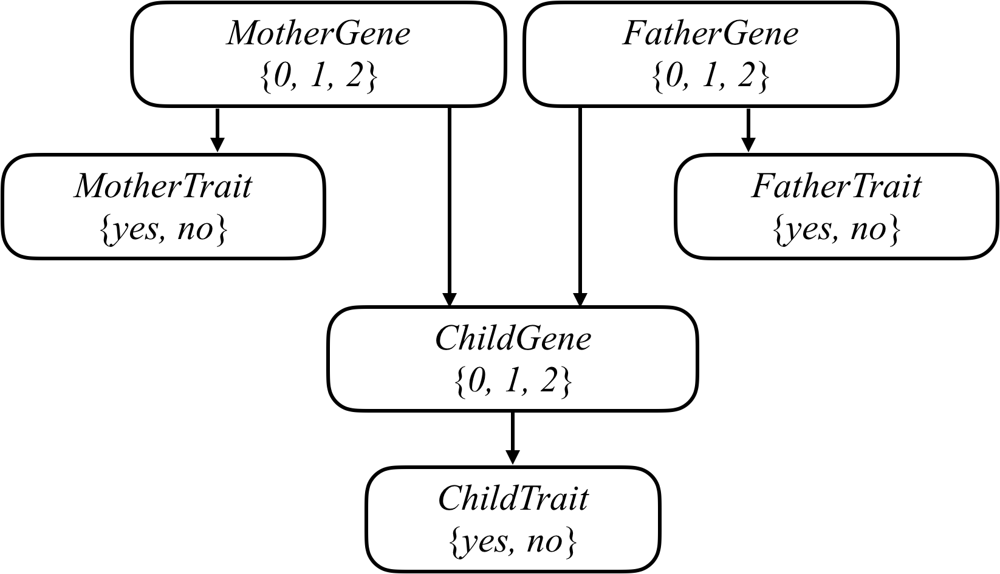

# Heredity

Mutated versions of the GJB2 gene are one of the leading causes of hearing impairment in newborns. Each person carries two versions of the gene, so each person has the potential to possess either 0, 1, or 2 copies of the hearing impairment version GJB2. Unless a person undergoes genetic testing, though, it's not so easy to know how many copies of mutated GJB2 a person has. This is some "hidden state": information that has an effect that we can observe (hearing impairment), but that we don't necessarily directly know. After all, some people might have 1 or 2 copies of mutated GJB2 but not exhibit hearing impairment, while others might have no copies of mutated GJB2 yet still exhibit hearing impairment.

Every child inherits one copy of the GJB2 gene from each of their parents. If a parent has two copies of the mutated gene, then they will pass the mutated gene on to the child; if a parent has no copies of the mutated gene, then they will not pass the mutated gene on to the child; and if a parent has one copy of the mutated gene, then the gene is passed on to the child with probability 0.5. After a gene is passed on, though, it has some probability of undergoing additional mutation: changing from a version of the gene that causes hearing impairment to a version that doesn't, or vice versa.

We can attempt to model all of these relationships by forming a Bayesian Network of all the relevant variables, as in the one below, which considers a family of two parents and a single child.



Each person in the family has a Gene random variable representing how many copies of a particular gene (e.g., the hearing impairment version of GJB2) a person has: a value that is 0, 1, or 2. Each person in the family also has a Trait random variable, which is yes or no depending on whether that person expresses a trait (e.g., hearing impairment) based on that gene. There's an arrow from each person's Gene variable to their Trait variable to encode the idea that a person's genes affect the probability that they have a particular trait. Meanwhile, there's also an arrow from both the mother and father's Gene random variable to their child's Gene random variable: the child's genes are dependent on the genes of their parents.

> Description taken from [Harvard Edu Online](https://cs50.harvard.edu).

For a high-level walkthrough of the logic, see [PSEUDOCODE.md](PSEUDOCODE.md).

## Functions

### utils.py

- `load_data(filename)` — Loads a CSV family dataset into a dictionary keyed by person name, including parent links and known trait values.

### probability.py

- `calculate_probabilities(people)` — Computes normalized gene and trait probability distributions for every person in the family.
- `joint_probability(people, one_gene, two_genes, have_trait)` — Returns the joint probability of a specific gene/trait assignment across the whole family.
- `update(probabilities, one_gene, two_genes, have_trait, p)` — Accumulates a joint probability `p` into the running distributions.
- `normalize(probabilities)` — Normalizes all distributions so each sums to 1.
- `powerset(s)` — Returns all subsets of a set (used to enumerate gene/trait combinations).

### main.py

- `validate_args(args)` — Validates CLI arguments and returns the input filename.
- `print_probabilities(people, probabilities)` — Prints each person's gene and trait distributions to stdout.

## Usage

```bash
python main.py data/family0.csv
```

Sample datasets are in `data/`: `family0.csv`, `family1.csv`, `family2.csv`.

## Installation

Install the required dependencies:

```bash
pip install -r requirements.txt
```

## Testing

Run all tests:

```bash
pytest
```

Run a specific test file:

```bash
pytest tests/test_probability.py
pytest tests/test_utils.py
```

Run a specific test function:

```bash
pytest tests/test_utils.py::test_function_name
```

Run tests matching a pattern:

```bash
pytest -k "test_name"
```

Run without coverage (faster):

```bash
pytest --no-cov
```
